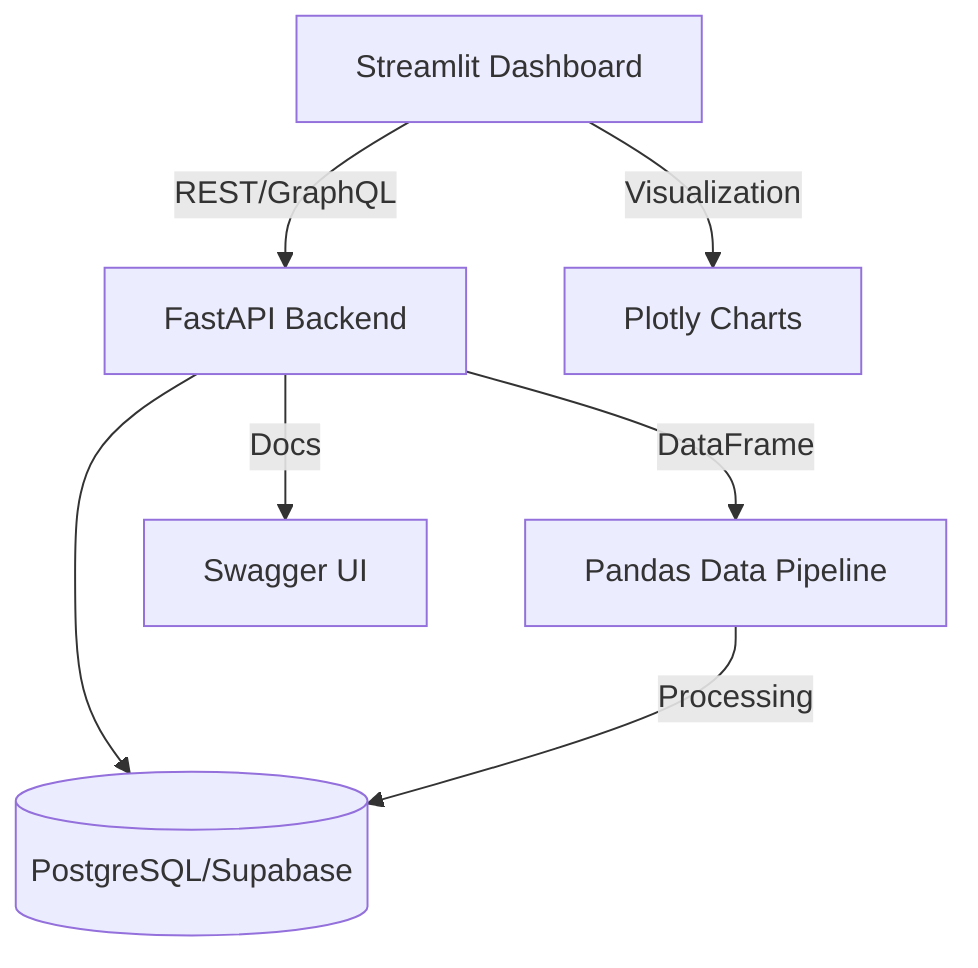

# Dash Analytics 🚀

A production-grade analytics platform for tracking, analyzing, and optimizing leads, appointments, and sales.  
**Built with modern Python, engineered for scale, and designed for real business impact.**

---

## 🌟 Why Dash Analytics?

- **Business-Driven:** Designed to provide actionable insights for sales, marketing, and operations teams.
- **Scalable Architecture:** Modular, async-ready, and built with best practices for data integrity, observability, and maintainability.
- **Enterprise-Grade Stack:** Combines Streamlit, FastAPI, PostgreSQL (Supabase), SQLAlchemy, and Pydantic.
- **AI/ML Ready:** Pipeline built for future integration of predictive analytics and real-time scoring.

---

## 🛠️ Features

- **Lead Management:** Full ETL for leads, appointments, and sales with robust data validation.
- **Real-Time Dashboards:** Interactive Streamlit UI with live updates and advanced visualizations (Plotly).
- **Marketing ROI & Attribution:** Cross-functional analytics to measure campaign effectiveness.
- **Custom Reporting:** Dynamic report generation and export (Excel, CSV).
- **API-First:** RESTful endpoints (FastAPI) with interactive Swagger docs and GraphQL support.
- **Defensive Engineering:** Comprehensive error handling, type safety, and transaction management.
- **Logging & Monitoring:** Diagnostic logging for every pipeline stage; ready for production monitoring.

---

## 🏗️ Architecture



- **Frontend:** Streamlit (interactive, real-time, responsive)
- **Backend:** FastAPI (async, RESTful, documented)
- **Database:** PostgreSQL (Supabase managed), SQLAlchemy ORM
- **Data Processing:** Pandas, Openpyxl, Plotly
- **Testing:** pytest (unit + integration, coverage reporting)
- **Logging:** Contextual logs with timestamps, function names, and error context

---

## ⚙️ Tech Stack

| Layer      | Technology                |
|------------|--------------------------|
| Frontend   | Streamlit, Plotly        |
| Backend    | FastAPI, GraphQL         |
| Database   | PostgreSQL (Supabase)    |
| ORM        | SQLAlchemy               |
| Validation | Pydantic                 |
| ETL        | Pandas, Openpyxl         |
| Caching    | Redis (planned)          |
| AI/ML      | Scikit-learn, TensorFlow (planned) |
| Testing    | pytest                  |

---

## 🚀 Getting Started

### Prerequisites

- Python 3.10+
- PostgreSQL (Supabase or local)
- pip

### Setup

```bash
# Install dependencies
pip install -r requirements.txt

# Start FastAPI backend
uvicorn backend.main:app --reload

# Start Streamlit frontend
streamlit run app.py
```

---

## 🧪 Testing

- Run all tests with:
  ```bash
  pytest --cov
  ```
- Coverage includes core ETL, API, and business logic.
- Mocking for external APIs and database.

---

## 📈 Logging & Monitoring

- Structured logging for every major flow (ETL, API, UI).
- Logs include timestamps, function names, and error context.
- Ready for integration with cloud monitoring and alerting.

---

## 🤖 AI/ML Roadmap

- Predictive lead scoring
- Conversion probability estimation
- Store performance forecasting
- Automated anomaly detection

---

## 👤 About the Author

**Luis Faria**  
- Senior Python & Data Engineer  
- Product-focused, business-driven, and passionate about building scalable analytics systems

---

## 📄 License

Proprietary software © Luis Faria.  
Open to collaboration and contributions.

---

## 💡 Why This Project?

- Building scalable, production-ready data platforms
- Modern Python engineering (async, typing, testing, logging)
- Business impact through analytics and automation
- End-to-end ownership: from ETL to UI

*Let’s build the future of analytics, together.*